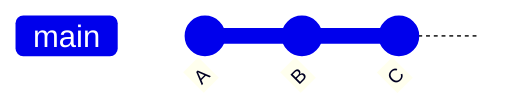
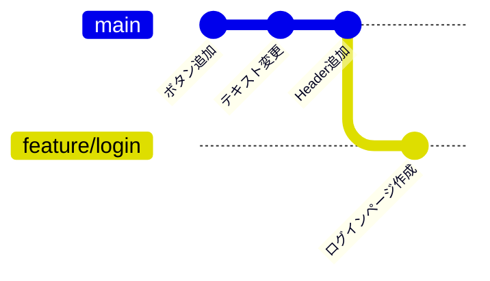

#Git #IT #知識 

[[Git]]のコマンドの一つ
`git brench　ブランチ名`とすることで現在の[[commit]]**からの分岐を行えることができ**
作業を分けることができる。

branchがない場合

branchを作成しcommitをすると

上記のように枝分かれするようになります
mainは本番環境の為なるべく触らないようにし、
branchを切って作業を行うことになります。
切ったbranchで作業を行ったあと[[push]]して
[[GitHub]]上で[[プルリクエスト]]を行い
レビューを受けて問題なければ[[marge]]を行う
