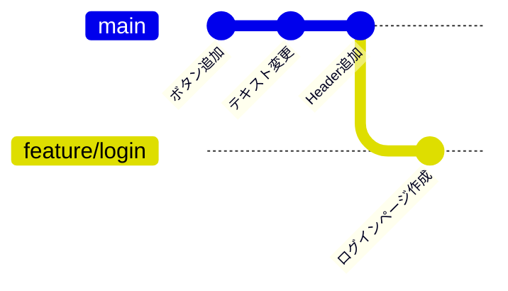
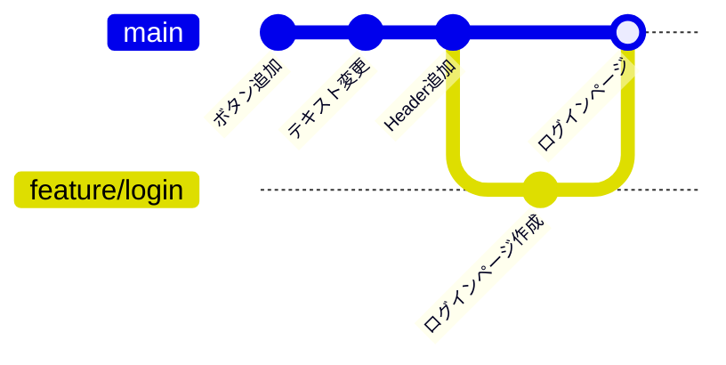

#Git

[[Git]]コマンドの１つ

別の[[branch]]の変更を今いるbranchに取り込むことができる

feature/loginブランチでcommit後

```mermaid
    gitGraph
       commit id: "ボタン追加"
       commit id: "テキスト変更"
       commit id: "Header追加"
       branch feature/login
       commit id: "ログインページ作成"

```
merge後

```mermaid
    gitGraph
       commit id: "ボタン追加"
       commit id: "テキスト変更"
       commit id: "Header追加"
       branch feature/login
       commit id: "ログインページ作成"
       checkout main
       merge feature/login id:"ログインページ"
       

```
## 起こる問題

mergeをした際に別の人が自分と同じ行を作業した際
[[コンフリクト]]が発生することがあり手動で直す必要がある。

