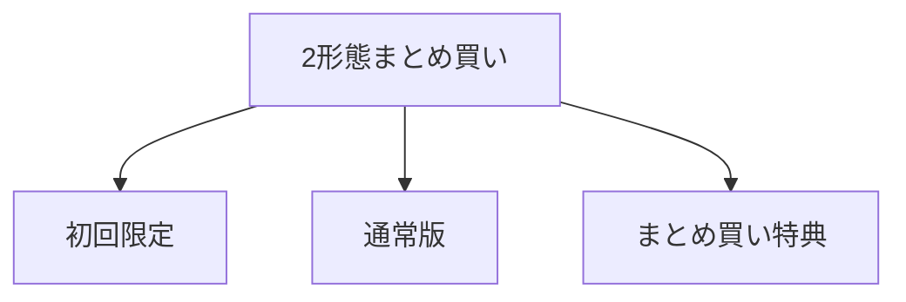

#仕事 

[[WMS]]で[[品目マスタ登録]]してある商品を
倉庫側にこれで１セットですよと連携させるための登録

商品でまとめ買いなどがあった場合などに使用する

```mermaid
graph TD
2形態まとめ買い-->初回限定;
2形態まとめ買い-->通常版;
2形態まとめ買い-->まとめ買い特典;
```

今回の例で言うと構成品マスタ登録を行うことで倉庫側に
２形態まとめ買いを購入してもらった場合
