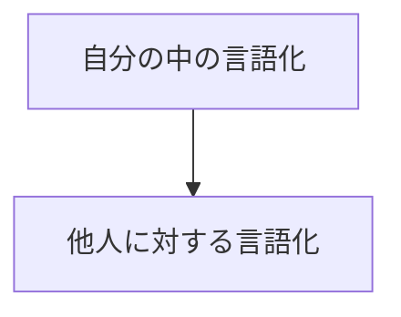

## 📖基本情報

- 著者: #三宅香帆
- ジャンル: #ビジネス
- 読了日:2025-12-31
## 目的

 言語化するのが苦手なので
伝えるにあたって語彙力を上げたい

## Chapter 1　言語化とは何か？

#### クリシェがあなたの言葉を奪う

`クリシェ`を避ける
クリシェは思考を停止させる

> クリシェとは決まり文句や、陳腐な表現のこと

よくあるクリシェ

| 感想クリシェ   | 仕事クリシェ    |
| :------- | :-------- |
| 泣ける      | 成長したい  |
| やばい      | やりがいがある   |
| 考えさせられた  | 人間関係がいい   |
| めっちゃよかった | がんばります    |
| 面白かった    | 検討します     |

#### 他人の言葉から自分を守る

 映画や読書などをした際に
 別の人の感想を見たり聞いたりすると
 あたかも自分も同じ考えだったと
 錯覚することがある。
 そうならない為にも言語化する前は
 他人の感想を見ないようにする

#### ２種類の言語化

`自分の中の言語化`と
`他人に対する言語化`の２種類がある

自分の中の言語化とは
クリシェを避けた自分なりの言葉でまとめること

他人に対する言語化とは
自分なりのまとめた言葉を他人に伝わるように
工夫する技術のこと

 必ず上記の順番を無視して行うと
 伝わらなかったり、自分で腑に落ちないことになる

## Chapter2 自分の中の言語化を磨く

#### 言語化できるかどうかは「細分化」にかかっている

必要なのは`語彙力`ではなく`細分化`が必要
言語化のために必要なプロセスは３つ
1. 心が動いた箇所の具体的な例をあげる
2. 感情を言語化する
3. メモをとる

その`1`,`2`のプロセスで重要なのはとにかく具体的に細かくあげること
なぜなら**細かければ細かいほど
クリシェから遠くなりオリジナリティに近づくから**

#### 「どういう感情」を抱いたのかを考える

ポジティブな感情のもとには`共感`か`驚き`がある
以下の３点を考えるとポジティブな感情を
見つけられる

1. 自分自身の体験との共通点を探す
2. 自分の好きなものとの共通点を探す
3. それのどこが新しいのかを考える

逆にネガティブな感情のもとには`不快`か`退屈`がある

`不快`の場合
1. 自分自身の`嫌な`体験との共通点を探す
2. 自分がすでに嫌いなものとの共通点を探す

`退屈`の場合
1. それのどこがありきたりなのかを考える

ネガティブな感情はポジティブな感情と違って
`一般論で考えがち`なのと`気持ちがネガティブ`になるため
言語化は困難な道のり

## Chapter3 他人に伝わる言語化を磨く

#### 伝わらない理由は情報格差
  
相手と自分の情報格差がある為、
伝えた際に自分で腑に落ちなかったり
相手に伝わっていない状態が作られる。

自分と相手との`情報格差`を埋めることが`伝える`ということ

情報格差を埋めるために知っておくべきことは
  
1. その情報についてどれくらい知っているか
2. その情報についてどのような印象を持っているか

#### 情報格差を埋める3つのパターン

1. 相手の知らない情報を補足する。
相手の情報量の異なりに応じて基礎知識や補足を伝える。
どこまで伝えるかが重要

2. 相手の興味の枠に合わせて譲歩する。
相手が興味ある事を枠に自分の伝えたいことを
入れることで興味を持って貰いやすくなる

3. 相手の興味無さを言及する。
 相手が興味ない場合は、あなたには興味ありますよという意思は
 伝えた上で、`興味ないのはわかってるんだけど`というサインを伝える