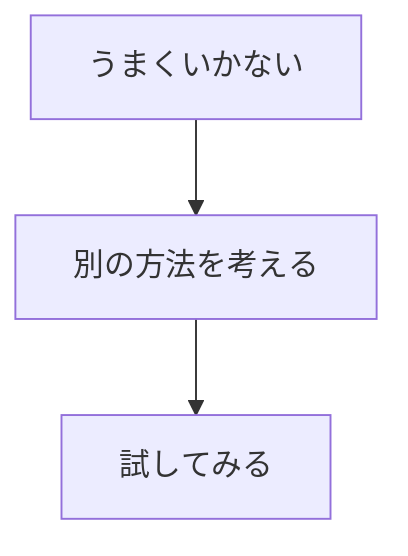

## 📖基本情報

- 著者: #中川諒
- ジャンル: #ビジネス
- 読了日:2026-04-08
## 目的

- 同僚の安藤さんがこの本いいよとおすすめしてくれた
- 賢くなりたいから、柔軟な頭脳を手に入れたい
- 発想とはなにか、アイデアを出すためにはどうすればいいのか知りたい

## 要約

#### アイデアとは

上手くいかない状態から脱出するための`工夫`から生まれる
工夫は３つの流れから出来ている

この工夫の流れの２番目`別の方法をか`