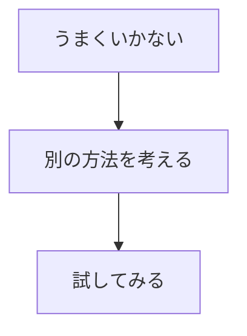
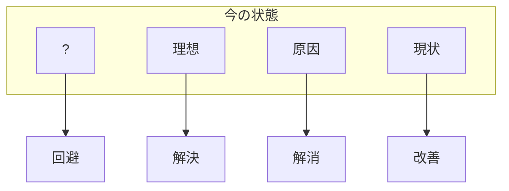

## 📖基本情報

- 著者: #中川諒
- ジャンル: #ビジネス
- 読了日:2026-04-08
## 目的

- 同僚の安藤さんがこの本いいよとおすすめしてくれた
- 賢くなりたいから、柔軟な頭脳を手に入れたい
- 発想とはなにか、アイデアを出すためにはどうすればいいのか知りたい

## 要約

#### 問題と課題の違い

問題：今の望ましくない状況のこと
課題：望ましくない状態から理想の状態になるために`やるべきこと`
#### いい企画とは

アイデアは自分勝手で良いが、企画となるとそうはならない

1. ギャップがあるっておもしろいこと
2. 誰かにとって役に立つこと

#### アイデアとは

上手くいかない状態から脱出するための`工夫`から生まれる
工夫は３つの流れから出来ている

この工夫の流れの２番目`別の方法を考える`がアイデアになる

#### 工夫の4K

工夫には４種類ある

1. 改善
   うまくいっていない状態から`今できる調整`をおこなうこと
2. 解決
   結果に注目してうまくいっていない状態を`処理`すること
3. 解消
   うまくいっていない状態の`原因そのものを排除`すること
4. 回避
   うまくいっていないことをやめて`別のことを始める`こと

例えば地元で店舗を出しているパン屋さんが悩み事をしています

